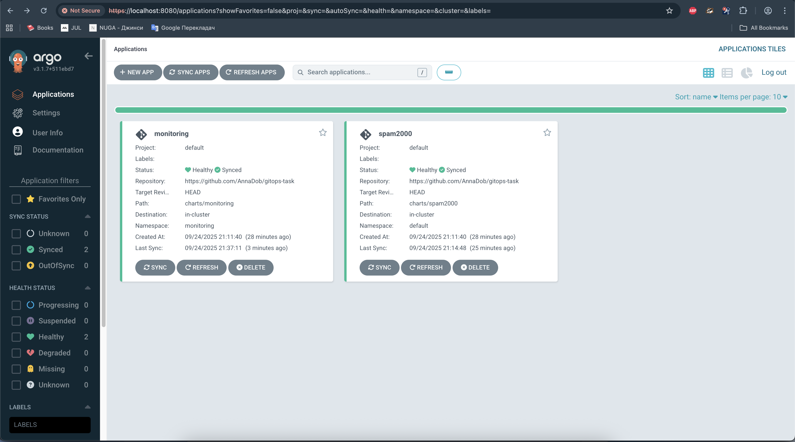
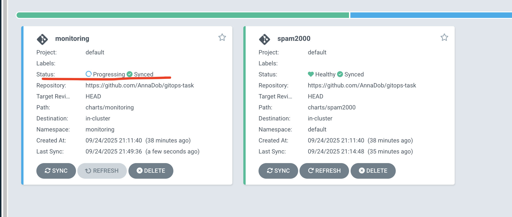
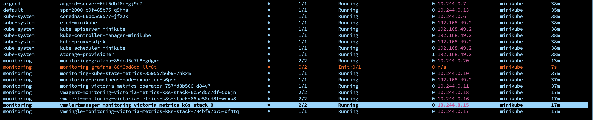
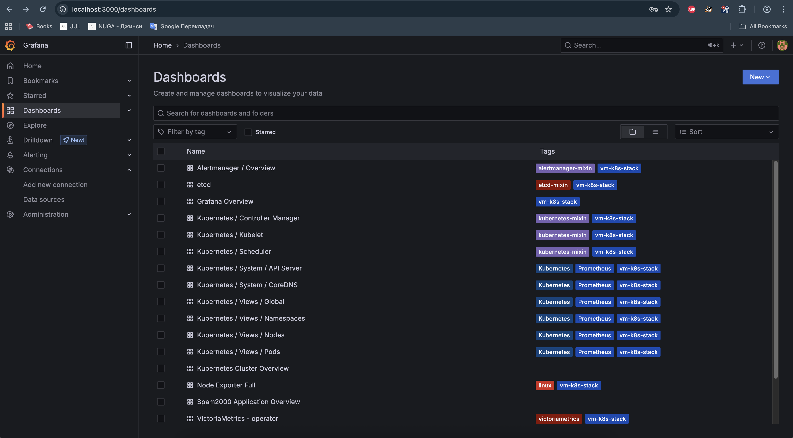
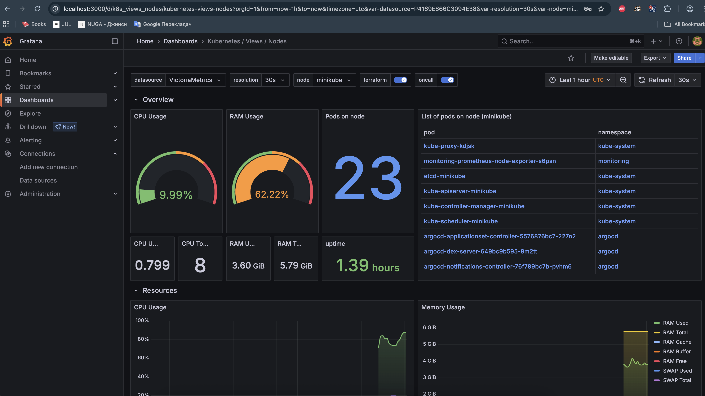
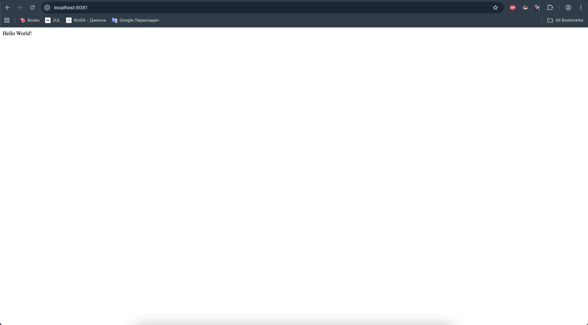
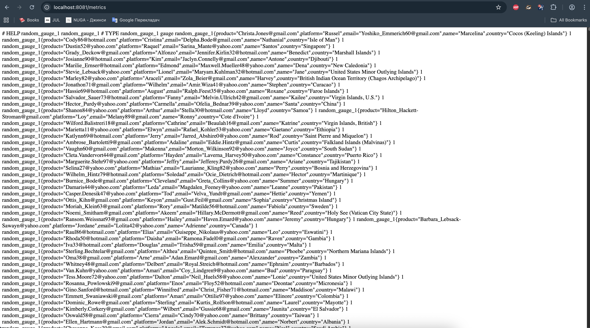

# GitOps Task

**Setup and run GitOps infrastructure with [spam2000 app](https://hub.docker.com/r/andriiuni/spam2000) and monitoring system.**

## Tech Stack

| Component        | Technology     | Purpose |
|------------------|---------------|---------|
| **Orchestration** | Minikube      | Local Kubernetes cluster |
| **GitOps**        | ArgoCD        | Automatic synchronization with Git |
| **Monitoring**    | VictoriaMetrics | Metrics collection and storage |
| **Visualization** | Grafana       | Dashboards and visualization |
| **Package Manager** | Helm        | Manage Kubernetes applications |
| **Application**   | spam2000      | Application that generates metrics |

## Prerequisites
The following tools must be installed on your local machine:
- Minikube
- kubectl
- Docker
- Helm
- Git
- ArgoCD CLI

## Installation

1. Clone the repository:
```bash
git clone https://github.com/AnnaDob/gitops-task.git
cd gitops-task
```

2. Run the bootstrap script:
```bash
./bootstrap.sh
```
3. Wait until the bootstrap script completes.
It may take up to 10 minutes for all pods to start and reach the Running state.

## Access to Applications
After the script finishes, the following services will be available:

| App | URL |
| --- | --- |
| **ArgoCD** | http://localhost:8080 |
| **Grafana** | http://localhost:3000 |
| **Spam2000** | http://localhost:8081 |


### ArgoCD
- URL: https://localhost:8080
- Username: admin
- Password:
```bash
kubectl -n argocd get secret argocd-initial-admin-secret -o jsonpath="{.data.password}" | base64 -d
```

### Grafana
- URL: http://localhost:3000
- Username: admin
- Password:
```bash
kubectl get secret monitoring-grafana -n monitoring -o jsonpath="{.data.admin-password}" | base64 -d; echo
```

### Spam2000 App
- URL: http://localhost:8081
- URL: http://localhost:8081/metrics

## Expected Result

- Everything is deployed with a single command
- Any parameter change in Git automatically updates deployed resources (GitOps)
- Monitoring system provides dashboards for both the cluster and the spam2000 app


### ArgoCD Application




### Grafana Dashboards



### Spam2000 App


